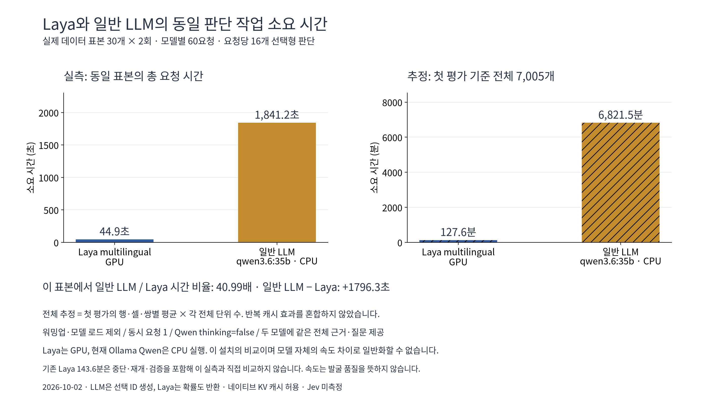
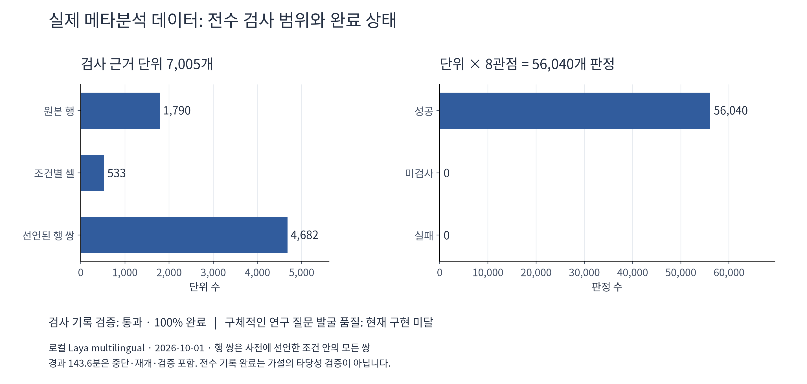
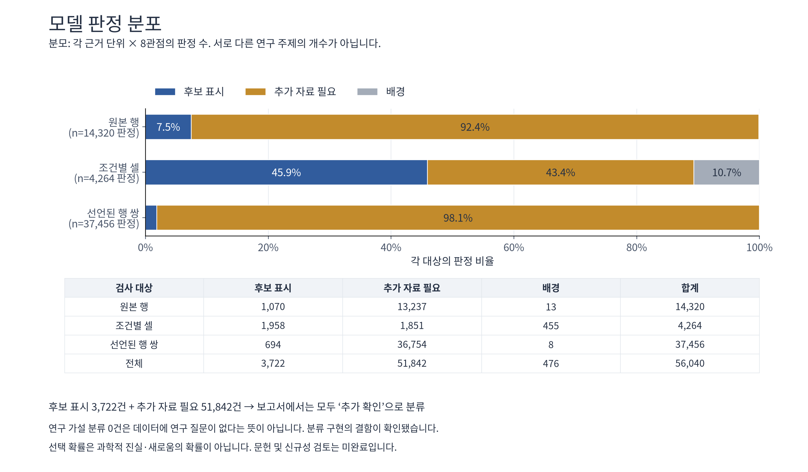

# Bio Topic Discovery

DEG·오믹스 결과표와 메타분석 원장을 대상으로 하는 **바이오 연구 후보 전수 검사 스킬**입니다. 로컬 **Laya**와 **TypeSafe Jev API** 중 하나를 프로파일에서 선택합니다.

> **실험적 연구 도구입니다.** 전수 모델 응답 기록은 검증했지만, 현재 고정 문구 기반 후보 출력과 합성 경고에 따른 분류가 구체적인 연구 질문 발굴을 충분히 지원하지 못합니다. 문헌 신규성·인과효과·가설의 타당성을 자동 검증하지 않습니다.

## 설치와 실행

Python 3.10 이상:

```bash
git clone https://github.com/hpend2373/bio-topic-discovery.git
cd bio-topic-discovery
python3 -m venv .venv
source .venv/bin/activate
python -m pip install -e .
```

### 로컬 Laya

기존 Laya 서버와 같은 리비전의 토크나이저가 있는 Docker 컨테이너를 사용합니다. 이 스킬은 서버를 시작하거나 모델 가중치를 추가 로드하지 않습니다. 프로파일의 `backend.url`, `container`, `model_path`를 설치 환경에 맞게 설정하세요.

```bash
bio-topics plan --input examples/meta.csv --profile profiles/meta.example.yaml --out runs/meta-laya
bio-topics run --out runs/meta-laya
bio-topics verify --out runs/meta-laya
```

### Jev API

고정 버전과 `TYPESAFE_API_KEY`가 필요합니다. `--allow-external`은 입력 근거를 TypeSafe API에 전송한다는 명시적 선택입니다.

```bash
export TYPESAFE_API_KEY="YOUR_KEY"
bio-topics plan --input examples/meta.csv --profile profiles/meta.jev.example.yaml --out runs/meta-jev
bio-topics run --out runs/meta-jev --allow-external
bio-topics verify --out runs/meta-jev
```

DEG는 각각 `profiles/deg.example.yaml`, `profiles/deg.jev.example.yaml`과 `examples/deg.csv`를 사용합니다. **예제는 합성 데이터**입니다. 실제 입력에서는 열 매핑·연구 질문·검사 범위를 맞추고 `synthetic_example: false`를 설정하세요. 상세 설정: [한국어 사용 안내](README.ko.md), [모델 연결](docs/backends.md).

## Codex 스킬

`skills/bio-topic-discovery/`가 배포할 스킬입니다. 엔진을 위와 같이 설치한 뒤 이 폴더를 Codex의 스킬 폴더에 복사할 수 있습니다.

```bash
cp -R skills/bio-topic-discovery ~/.codex/skills/
python skills/bio-topic-discovery/scripts/run.py --project "$PWD" --help
```

스킬 실행기는 저장소 위치를 자동으로 찾거나 설치된 `bio_topics`를 사용합니다. 다른 위치는 `--project PATH` 또는 `BIO_TOPIC_DISCOVERY_ROOT`로 지정합니다.

## 전수 검사 계약

```text
CSV/Excel → 열 매핑·원본 보존 → 결정론적 사실
         → 모든 행·셀·선언된 쌍 × 모든 관점 → Laya / Jev
         → 응답·근거 연결 → 범위 검증 → 후보·추가 확인 기록
         → 후속 과학적 검토와 사람의 결정
```

- FDR·상위 K개·시간 제한으로 모델 검사 대상을 줄이지 않습니다.
- 쌍 범위는 `all`, `within_groups`, `none`으로 실행 전에 선언합니다. 모든 가능한 분석을 전수 검사했다는 뜻은 아닙니다.
- 보류·차단·약한 근거도 모델 검사에 포함하고, 합성 승인 상태는 보존합니다.
- 같은 입력·질문·모델·코드에서만 재개합니다. 서로 다른 백엔드를 쓰려면 새 실행을 만듭니다.
- 실제 모델 응답 없는 검사와 실패는 미완료입니다. 합성 응답을 사용한 테스트는 실제 모델 완료로 인정하지 않습니다.

## 일반 LLM과 소요 시간 비교



같은 실제 근거 30개와 16개 선택형 질문을 각각 2회 평가한 실측입니다. 왼쪽은 모델별 동일 표본의 총 요청 시간, 오른쪽은 **첫 평가**의 행·셀·쌍별 평균으로 계산한 전체 요청 시간 **추정치**입니다. 반복 캐시 효과를 새 데이터 전체 시간에 섞지 않았습니다. 일반 LLM은 로컬 `qwen3.6:35b`입니다.

**NVIDIA GB10에서 두 모델을 각각 단독으로 GPU에 적재해 재측정했습니다.** Qwen은 42/42 레이어의 GPU 적재를 확인했습니다. 이 표본의 처리 시간이며 발굴 품질 비교는 아닙니다. [측정 조건·실측 기록·재현](docs/evaluation/LATENCY.ko.md)

## 실제 데이터 시험

2026-10-01, 로컬 Laya multilingual로 **1,790행 + 533셀 + 선언된 4,682쌍**을 평가했습니다.

| 항목 | 결과 |
|---|---:|
| 단위 × 8관점 판정 | 56,040 / 56,040 |
| 실패 / 미검사 | 0 / 0 |
| 모델의 candidate 표시 | 3,722건 |
| 추가 자료 필요 표시 | 51,842건 |
| 배경 표시 | 476건 |
| 구체적인 연구 질문 발굴 품질 | 현재 구현 미달 |

후보 표시는 연구 주제의 개수가 아닙니다. 배경을 제외한 55,564개 항목이 모두 ‘추가 확인’으로 분류됐고, 고정 제목 52종으로 출력됐습니다. 합성 관련 경고가 가설 경로를 막는 결함과 수치 점검 누락을 확인했습니다. Jev는 연결 계약을 시험했으나 API 키가 없어 실제 서비스 호출은 검증하지 않았습니다.





[집계 결과·한계·그래프 재현](docs/evaluation/README.md). 업로드된 시험 자료는 집계값이며, 원본 입력과 전체 모델 응답은 포함하지 않습니다. 해당 벤치마크는 동결된 이전 코드로 수행했고, 이 배포의 이식성·Jev 검증 개선을 실제 데이터로 다시 시험한 결과가 아닙니다.

## 개발 검사

```bash
python -m unittest discover -s tests -v
```

백엔드 계약 테스트는 합성 응답을 사용합니다. 전체 단위 테스트 22개와 스킬 형식 검사가 통과했습니다. 과학적 발굴 품질 평가는 별도입니다.

## 공식 자료

- [TypeSafe Jev API](https://docs.typesafe.ai/api), [모델 버전](https://docs.typesafe.ai/models)
- [Laya 공식 저장소](https://github.com/ConvaiInnovations/laya)
